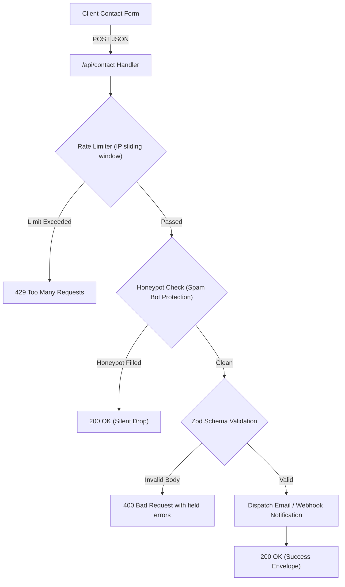

# System Architecture & Tech Stack (ARCHITECTURE.md)

## 1. Technology Stack
* **Framework:** Next.js 15 (App Router, React 19)
* **Language & Typing:** TypeScript 5 (Strict mode enabled, `noImplicitAny: true`, zero `any` types)
* **Styling & Design System:** Tailwind CSS v3.4 (Tailwind PostCSS configuration with `tailwind.config.ts` defining Stitch V2 design tokens, color variables, Space Grotesk and Inter fonts)
* **Icons:** Lucide React (Clean, geometric icons with consistent stroke weights)
* **Animation & Micro-interactions:** Framer Motion (Restrained springs, viewport opacity transitions, smooth layout reflows)
* **Form & Data Validation:** Zod (Strict client & server schema validation)
* **Testing Suite:**
  * **Unit & Integration:** Vitest + React Testing Library
  * **End-to-End (E2E):** Playwright (Cross-browser: Chromium, Firefox, WebKit, Mobile Safari / Mobile Chrome)
* **Deployment Platform:** Vercel (Edge network, automated CI/CD, asset compression)

---

## 2. Directory Structure

```
likhith-portfolio/
├── docs/
│   ├── PRD.md
│   ├── DESIGN.md
│   ├── ARCHITECTURE.md
│   ├── CONTENT.md
│   ├── ROUTES.md
│   ├── COMPONENTS.md
│   └── QA.md
├── tests/
│   ├── unit/
│   │   ├── data.test.ts              # Validates centralized data integrity & types
│   │   ├── schema.test.ts            # Validates Zod contact form schemas
│   │   └── button.test.tsx           # Unit tests for UI primitives
│   ├── integration/
│   │   └── api-contact.test.ts       # Contact API route, rate-limiting & error envelopes
│   └── e2e/
│       ├── navigation.spec.ts        # Desktop & Mobile navigation, smooth scrolling
│       ├── case-studies.spec.ts      # /work/devbridge and /work/e-library routes
│       └── contact-form.spec.ts      # Contact form submission & copy-to-clipboard
├── src/
│   ├── app/
│   │   ├── layout.tsx                # Root layout with Space Grotesk & Inter font optimization
│   │   ├── page.tsx                  # 6-Section Homepage (consumes centralized data)
│   │   ├── work/
│   │   │   ├── devbridge/
│   │   │   │   └── page.tsx          # DevBridge Flagship Case Study
│   │   │   └── e-library/
│   │   │       └── page.tsx          # IJRAR Published Research Case Study
│   │   ├── api/
│   │   │   └── contact/
│   │   │       └── route.ts          # Zod-validated contact transmission API with rate limiting
│   │   ├── globals.css               # Design tokens, CSS variables, base utilities
│   │   ├── robots.ts                 # Search crawler rules
│   │   └── sitemap.ts                # XML sitemap generation
│   ├── components/
│   │   ├── layout/
│   │   │   ├── Navbar.tsx            # Floating glass header with availability badge
│   │   │   ├── MobileNav.tsx         # Mobile drawer & thumb navigation
│   │   │   └── Footer.tsx            # Editorial closing & copyright footer
│   │   ├── sections/
│   │   │   ├── HeroSection.tsx       # Human-first dual-craft hero
│   │   │   ├── DevBridgeShowcase.tsx # 2-Column editorial flagship project showcase
│   │   │   ├── ELibraryShowcase.tsx  # Academic research monograph showcase
│   │   │   ├── CapabilitiesSection.tsx # 4-Domain capability matrix
│   │   │   ├── ExperienceSection.tsx # Blackbucks internship & B.Tech milestones
│   │   │   └── ContactSection.tsx    # Direct coordinates & inquiry form
│   │   └── ui/
│   │       ├── Button.tsx            # Primary (indigo), Secondary (outline), Ghost
│   │       ├── Badge.tsx             # Status tags, category pills
│   │       ├── Card.tsx              # Tonal surface card container
│   │       ├── DeviceFrame.tsx       # Mobile phone preview frame for DevBridge
│   │       └── Input.tsx / Textarea.tsx # Form controls with focus rings
│   ├── types/
│   │   ├── profile.ts                # TypeScript definitions for personal & contact data
│   │   ├── projects.ts               # TypeScript definitions for case studies & UX flows
│   │   ├── skills.ts                 # TypeScript definitions for skill categories
│   │   ├── experience.ts             # TypeScript definitions for milestones & certifications
│   │   └── contact.ts                # Zod schemas & API response types
│   ├── lib/
│   │   ├── rate-limit.ts             # In-memory token bucket / IP sliding window rate limiter
│   │   └── email.ts                  # Safe notification dispatcher / email logger
│   └── data/
│       ├── profile.ts                # Authoritative personal profile data
│       ├── projects.ts               # Authoritative DevBridge & E-Library project data
│       ├── skills.ts                 # Authoritative 4-domain skill data
│       └── experience.ts             # Authoritative internship, education & certs data
├── public/
│   ├── assets/                       # Optimized WebP/SVG project assets
│   └── JADAGAM_LIKHITH_Resume.pdf    # Authentic downloadable resume asset
├── playwright.config.ts              # Playwright multi-browser test configuration
├── vitest.config.ts                  # Vitest unit/integration configuration
├── tailwind.config.ts                # Tailwind CSS v3.4 configuration
├── postcss.config.js                 # PostCSS configuration
├── tsconfig.json                     # Strict TypeScript configuration
├── next.config.ts                    # Next.js 15 build configuration
└── package.json
```

---

## 3. Data Architecture & Type Safety
All portfolio content is strictly centralized in four strongly typed data modules. Components **never hardcode or duplicate** profile information:
1. `src/data/profile.ts` $\rightarrow$ typed by `ProfileData` (`name`, `title`, `location`, `cgpa`, `email`, `socials`).
2. `src/data/projects.ts` $\rightarrow$ typed by `ProjectData[]` (`id`, `title`, `tag`, `techStack`, `uxFlows`, `narrative`, `citation`).
3. `src/data/skills.ts` $\rightarrow$ typed by `SkillCategory[]` (`domain`, `skills`, `description`).
4. `src/data/experience.ts` $\rightarrow$ typed by `ExperienceData`, `EducationData[]`, `CertificationData[]`.

---

## 4. Backend & Contact Route Architecture (`/api/contact`)

To keep the application frontend-first and lightweight without bloated database dependencies, the contact subsystem uses a robust serverless Next.js Route Handler:



### Key Technical Specifications for Contact API:
1. **Zod Validation Schema (`src/types/contact.ts`):**
   * `name`: string, min 2 chars, max 100 chars, sanitized.
   * `email`: string, valid email format, max 255 chars.
   * `subject`: string, min 3 chars, max 150 chars.
   * `message`: string, min 10 chars, max 2000 chars.
   * `honeypot`: optional string (must be empty for genuine users).
2. **Rate Limiting (`src/lib/rate-limit.ts`):**
   * In-memory sliding window rate limiter (max 5 requests per 10 minutes per IP address) returning `429 Too Many Requests` when exceeded.
3. **Spam Protection:**
   * Invisible honeypot field (`website` / `hp_company`). If populated by automated bots, the request returns `200 OK` but discards the payload without dispatching.
4. **Notification Dispatcher (`src/lib/email.ts`):**
   * Configurable dispatcher supporting SMTP / Resend with graceful fallback to secure structured logging in development/staging environments.
5. **Safe Error Handling:**
   * Consistent response envelopes:
     * Success: `{ success: true, message: "Your message has been received." }`
     * Client Error: `{ success: false, error: "Validation failed", details: [...] }`
     * Server Error: `{ success: false, error: "Unable to send message at this time. Please email likhithjadagam7@gmail.com directly." }`
   * Never leaks internal server stack traces or environment variables.

---

## 5. Testing & Quality Architecture
* **Unit Testing (`tests/unit/`):**
  * Data type conformance tests verifying all required fields exist in `src/data/`.
  * Zod schema parsing unit tests for edge cases (malformed emails, injection payloads, empty strings).
  * UI component unit tests verifying variant classes, accessibility tags, and button states.
* **Integration Testing (`tests/integration/`):**
  * Direct Route Handler testing for `POST /api/contact` (valid payload, invalid payload, rate-limiting triggers, honeypot traps).
* **End-to-End Testing (`tests/e-2e/` via Playwright):**
  * `navigation.spec.ts`: Validates page load, header visibility, anchor smooth scrolling to all 6 homepage sections, and mobile drawer interaction.
  * `case-studies.spec.ts`: Validates routing to `/work/devbridge` and `/work/e-library`, breadcrumb back-navigation, and content rendering.
  * `contact-form.spec.ts`: Validates form filling, validation error triggers, successful submission UI feedback, and copy-to-clipboard functionality for email.
